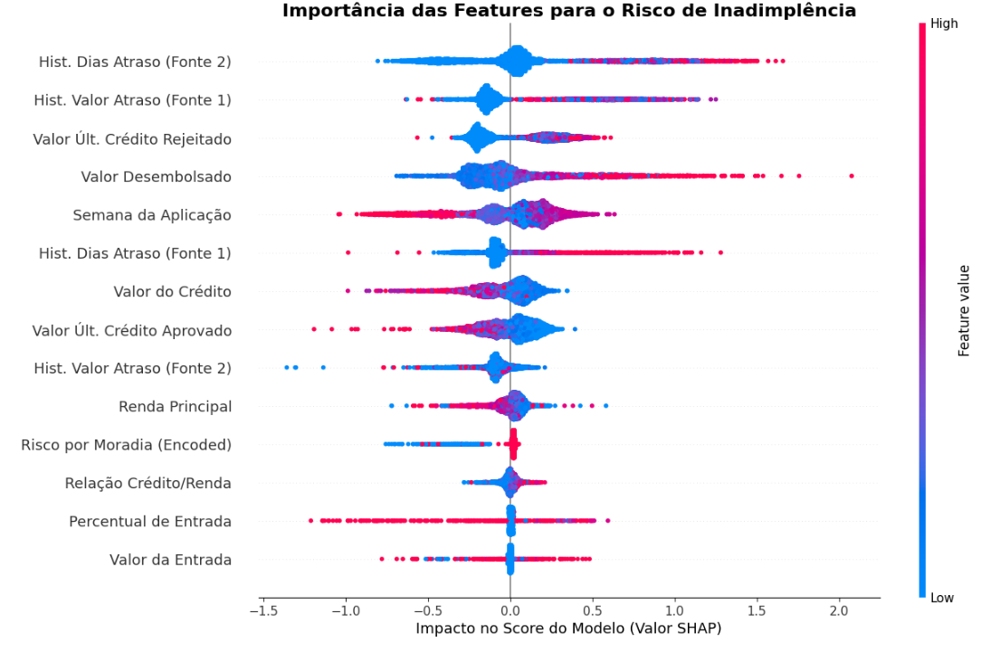
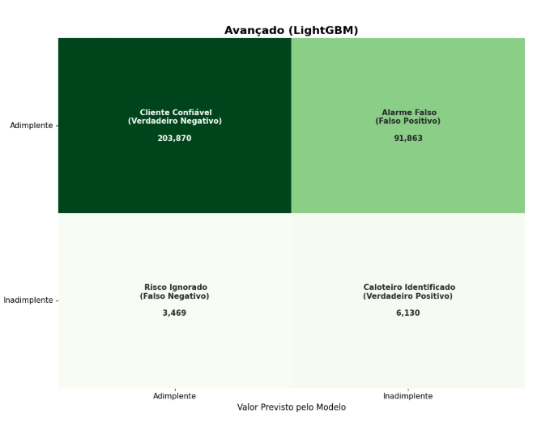

# 📊 Modelo Preditivo para Análise de Risco de Crédito

<p align="center">
  
  
  

</p>

<p align="center">
  
</p>

## 🌟 Resumo do Projeto

Este projeto foi desenvolvido como um case técnico para a vaga de Cientista de Dados, com o objetivo de criar uma solução **de ponta a ponta** para aprimorar a avaliação de risco de crédito em uma instituição financeira. A solução envolve desde a análise exploratória até a criação de um modelo preditivo robusto, com ênfase em interpretabilidade e mitigação de prejuízos.

**[🔗 Clique aqui para acessar o Notebook no Kaggle](https://www.kaggle.com/code/carllux/analise-risco-credito-python)**

---

## 🛠️ Ferramentas e Tecnologias

* **Python 3:** Linguagem principal do projeto.
* **Pandas & NumPy:** Manipulação de dados e operações numéricas.
* **Matplotlib & Seaborn:** Visualização gráfica para a EDA.
* **Scikit-learn:** Divisão de dados, modelo baseline, métricas de avaliação.
* **LightGBM:** Modelo avançado com técnica de Gradient Boosting.
* **SHAP:** Explicação dos resultados do modelo (XAI).
* **Kaggle Notebooks:** Ambiente de execução, devido à alta demanda de RAM (> 26GB).

---

<p align="center">
  
</p>

## 🚀 Funcionalidades e Análises Principais

* **Pipeline Robusto:** Processamento de múltiplos arquivos `.parquet` e tratamento de dados inconsistentes.
* **Análise Exploratória Profunda:** Detecção de desbalanceamento (\~3% inadimplentes) e descoberta de padrões com visualizações interativas.
* **Engenharia de Features:** Criação de variáveis como `relacao_credito_renda`, `percentual_entrada`, entre outras.
* **Modelagem Comparativa:** Comparativo entre modelo baseline (Logística) e modelo avançado (LightGBM).
* **Métricas de Performance:** AUC = 0.7240, Recall para inadimplentes = 64%.
* **XAI com SHAP:** Geração de sumários e visualizações que explicam os fatores de risco mais relevantes.

---

## 📊 Estrutura do Projeto

Atualmente sendo reproduzível utilizando do link do Kaggle Notebook acima, o código está sendo refaturado para reestruturação.

O projeto será dividido em **dois notebooks** para melhor organização e reprodutibilidade:

### Notebook 1: Preparação e Análise Exploratória (EDA)

* Carregamento e integração dos arquivos de dados.
* Limpeza, filtragem e transformação de colunas.
* Visualizações gráficas e métricas descritivas por classe.

### Notebook 2: Modelagem e Interpretação

* Treinamento dos modelos (baseline e avançado).
* Avaliação com ROC AUC, precision, recall.
* Geração de interpretações com SHAP para suporte à tomada de decisão.

---

## 💡 Destaque Técnico: Tratamento de Desbalanceamento

A chave para a performance do modelo LightGBM foi o uso do parâmetro `scale_pos_weight`, que corrige o desequilíbrio severo de classes sem a necessidade de oversampling ou undersampling.

```python
# Cálculo do peso para forçar o modelo a focar na classe de inadimplentes
scale_pos_weight = y_train.value_counts()[0] / y_train.value_counts()[1]

# Instanciando o modelo com o parâmetro estratégico
lgbm_model = lgb.LGBMClassifier(
    random_state=42,
    scale_pos_weight=scale_pos_weight,  # <-- A técnica chave
    n_estimators=300
)
```

Essa abordagem resultou em um recall de **64% para a classe de inadimplentes**, um salto de 0% em relação ao modelo baseline, tornando a solução eficaz para o problema de negócio.

---

## 👤 Autor

[](https://www.linkedin.com/in/carlos-vinicius-nascimento-de-jesus/)
[](https://github.com/Carllux/)
